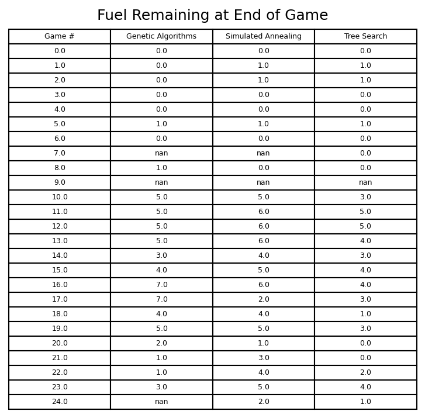
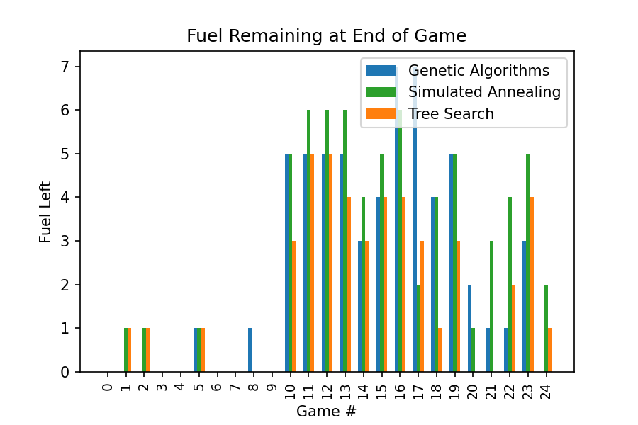
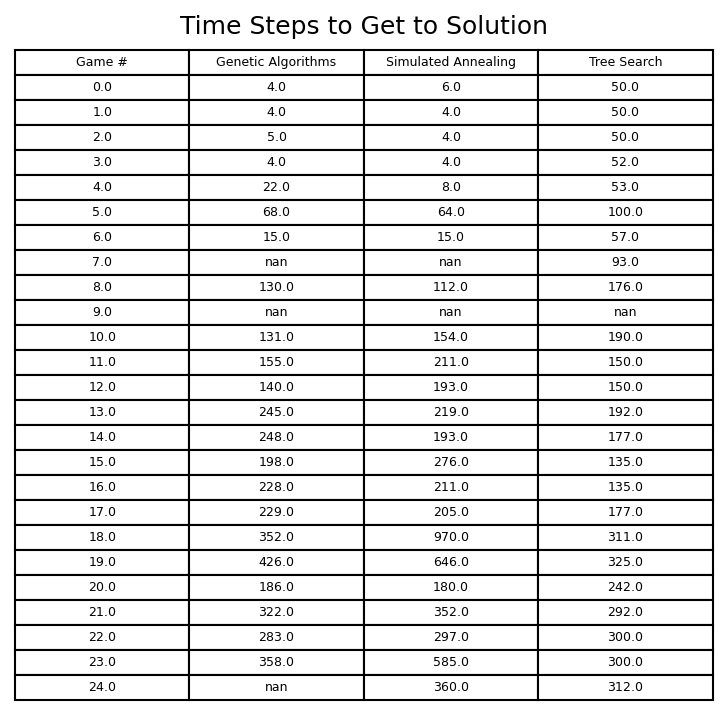
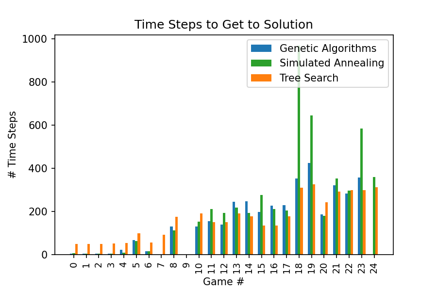
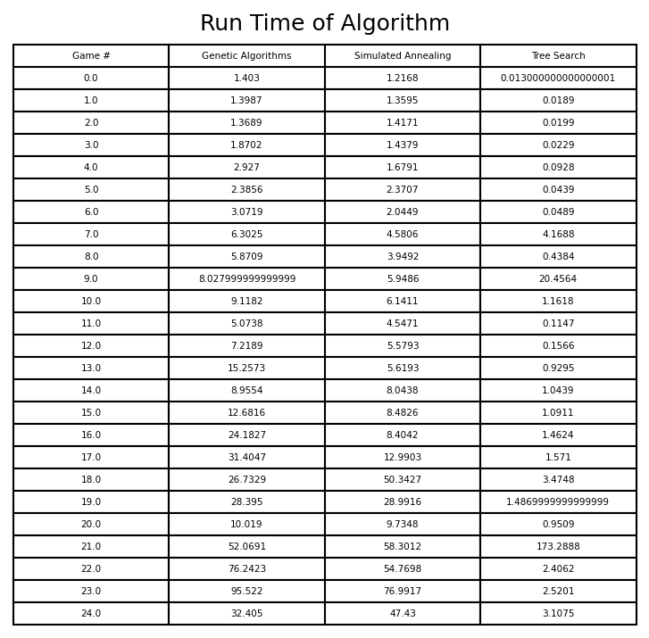
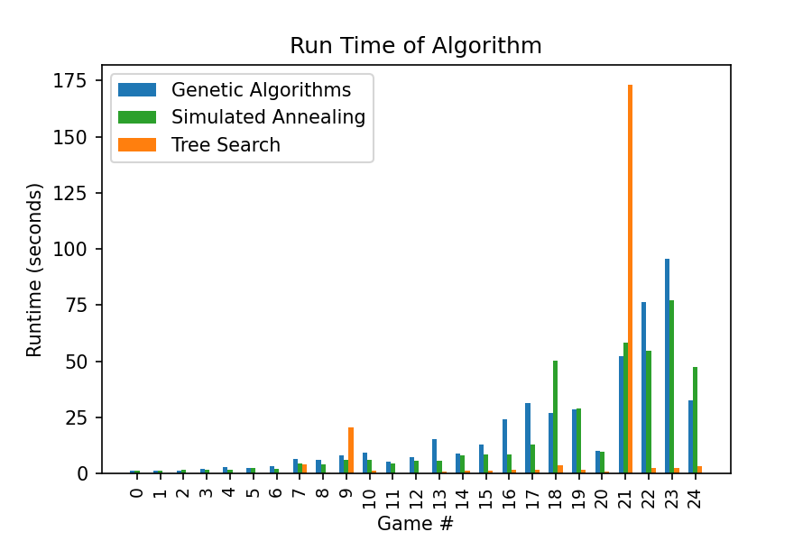

# Project #1
Dade Wood, daw1882


## Genetic Algorithm
Usage: ```python asteroid_ga[#].py -i asteroid_game_11.json```

### Modifications to base algo:
Fitness Function (main difference):
1. For move in chromosome's move list:
    1. act on the move in the environment
    1. if env goal state is FAIL, return the ships current x location
    1. else if the ship has reached the goal (goal state is SUCCESS), return window_width + fuel_remaining*100 + large_constant
    1. else update how far the ship is from its x location
1. return ship_x_loc * 10 + fuel_remaining * 10

The multiplication and addition of constants in the fitness scoring is to provide a larger difference between fitness scores as the fitness increases. This is needed because the random selection function uses probabilities of each member being selected and the probabilities are calculated using the total fitness of all population members. This is also the reason for keeping the population so small (10 members). 

The representation of a chromosome (move set) in the genetic algorithm is used as a list of 15 moves that can be sliced and concatenated to do the reproduction and mutations.
     

### Difficulties:

There were two game files that posed the biggest issue for this algorithm: game 7 and game 24. Each of them bring up an issue with the fitness function that is
fairly hard to solve without just increasing the number of iterations the algorithm runs for. 

Game 7 starts the ship with only 2 units of fuel. What this means is that when the fitness function adds the remaining fuel as part of the overall fitness, 
the algorithm can get focused on trying to save as much fuel as possible instead of using all of it which is what is needed in the solution. If the fitness 
function decided to only optimize fuel when a valid solution has been found, then we would get the opposite problem (but for more games) where the algorithm 
would only focus on getting as far as possible without properly managing its fuel consumption on the way there. Ultimately it was decided to keep fuel in as 
part of the intermediate fitness score since the main game it affected was game 7.

Game 24 had a seperate problem. Its issue is that in order to make it fully across the board there are certain points in the environment where it is better 
stand still and wait for a good time to continue onwards. Standing still does not directly impact the fitness score at all so it neither encourages nor discourages
uses this move and thus it often ignores it and focuses on the moves that give the score progress. There's no easy way to account for this in the score and I 
decided to leave it out because if it were included in some form where the "survival time" was used instead, it would encourage the algorithm to just stand in 
place for all moves as long as possible. There may be a way to modify it such that it has enough constraints to be able to account for sitting still but it seemed
overly complex to implement for a single case.

### Results:


## Simulated Annealing
Usage: ```python asteroid_sa[#].py -i asteroid_game_11.json```

### Modifications to base algo:


### Difficulties:
Simulated Annealing had the exact same problems when it game to games 7 and 24 for its cost function. The two functions are fairly similar so they have the 
same issues for examples such as these.

**\*It should be noted that while game 7 and 24 do fail often for these two algorithms, they do not fail everytime. It is possible for the algorithm to find a solution 
for both but it just depends on the randomization aspect being in its favor.**

### Results:


## Tree Search
Usage: ```python asteroid_tree[#].py -i asteroid_game_11.json```

### Modifications to base algo:

This tree uses a heuristic approach similar to A*. Instead of a stack, the nodes get stored in a min-heap with the most priority going to the paths that minimize the cost from the space ship's current position to the end of the screen. In order to do this, I just had to track the time steps for whenever the ship was moving and store it in a new node variable path_cost so that it could be used to calculate end_cost which is the distance in a straight line to the end of the screen. As a bonus, end_cost also adds any fuel usage to it in an attempt to lower the amount of total fuel used, but the algorithm still ends at the first solution found, so this does not guarantee the least amount of fuel used every time.

### Results:
Overall I'd say this was the best option for this task (though it likely wouldn't continue to be since it doesn't scale well as the 
probelm size increases). The reason this performed the best and found a solution consistently was because it exhausted all the options to reach the end goal. 
Also, by adding a heuristic to the search, it is able to handle most of the larger problems in a reasonable amount of time since it prunes many of the useless
branches and focuses on the branches most likely to lead to the solution. 


## Figures and Data
Usage: ```python generate_reports.py```

*Note: you also need to uncomment the line at the bottom if you want to generate the tables.

### Fuel:



### Game Time:



### Run Time:


